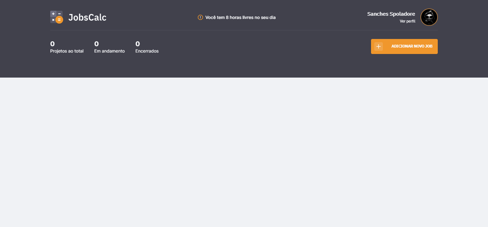

# JobsCalc

## Conteúdo
- [Sobre](#sobre)
- [Tecnologias](#tecnologias)
- [Autor](#autor)

## Sobre
Projeto criado durante a Maratona Discover 02. JobsCalc é um aplicativo de cálculo e estimativa para projetos freelancer, você pode cadastrar e excluir jobs (projetos) e obter estimativas de custo para cada trabalho. Além disso pode obter a informação de quanto custa a hora de trabalho.

## Tecnologias
- HTML
- CSS
- JavaScript
- NodeJS
- EJS
- Express
- SQLite

## Autor
- Site - https://sanches-spoladore.netlify.app